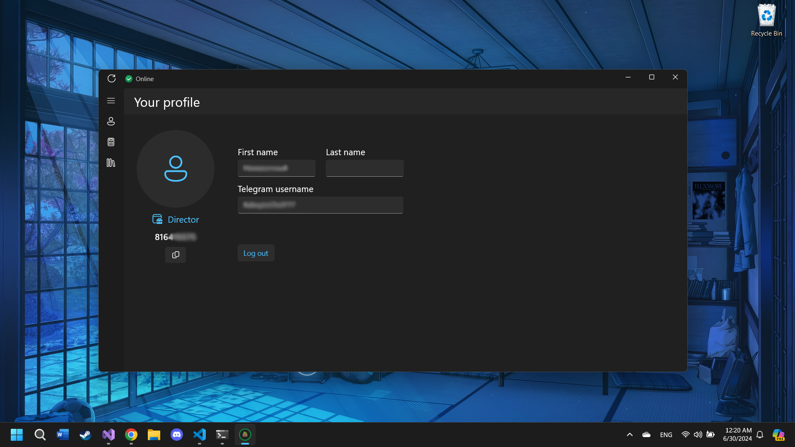
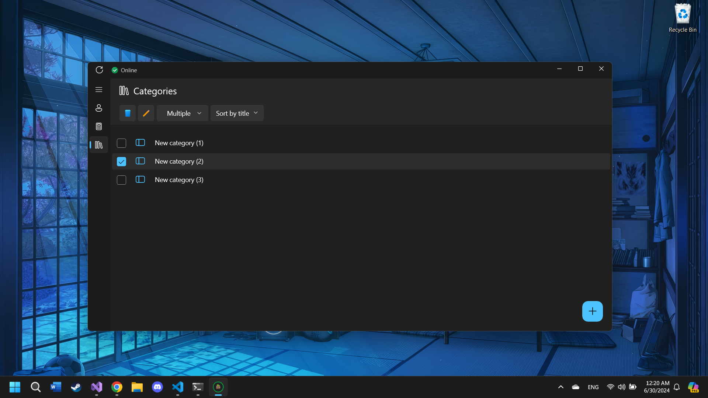
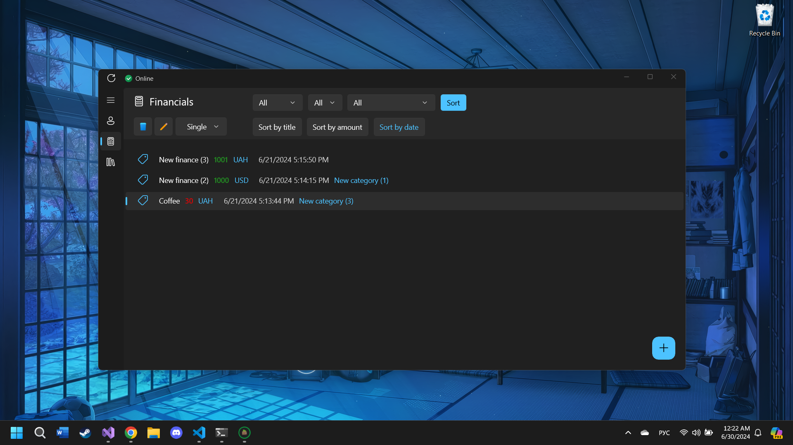
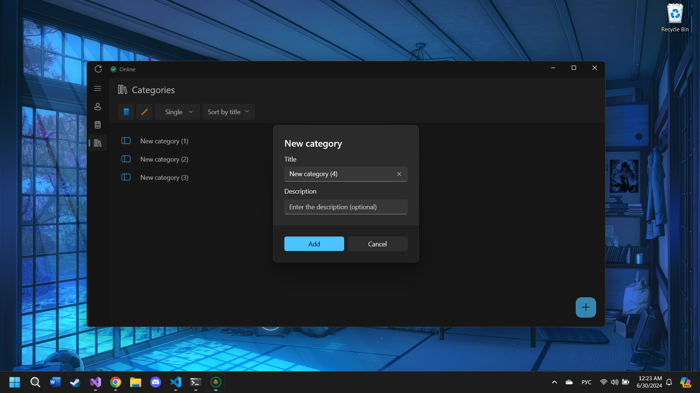
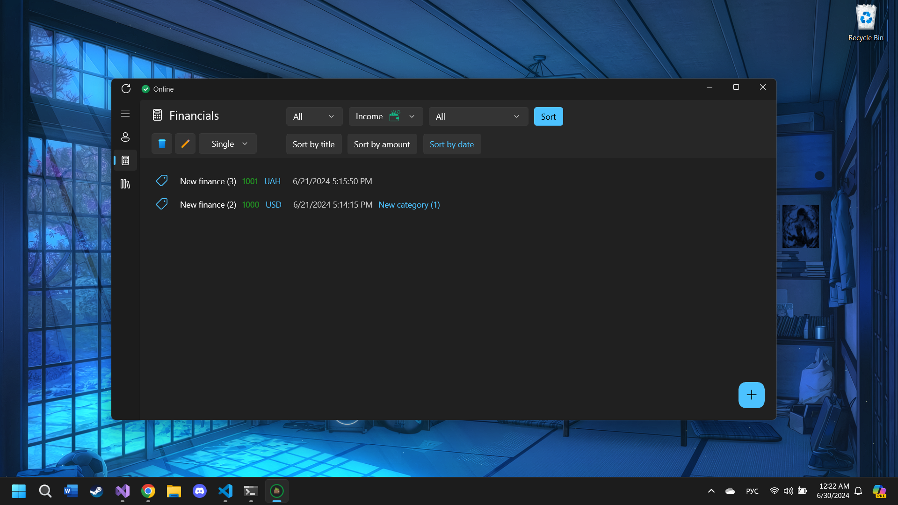

# Description of the project "Financial manager":

## Languages
- [Українська](./README_UA.md)
- [Русский](./README_RU.md)
- [English](./README.md)

**"Financial manager"** - is a project application designet using **WinUI3 Windows App SDK**. This project combines two applications: a **server** and a **client**. The server combines the logic for interacting with the client and the logic for the bot in the Telegram messenger, and also the database of financial transactions.

The client, in turn, is designed for the interaction of the accountant with the database of financial transactions.

## About Telegram bot

Telegram bot in the context of the project is necessary for authorization of new accountants in the system, as well as quick viewing by them of the list of financial transactions and categories with the ability to sort financial transactions, but without the ability to edit data. The confirmation code comes exactly in the chat with the bot.

## User authorization

When opening the application for the first time, the employee will see a page asking them to log in to their personal account. In order to do this, you need to enter your ID, which can be obtained by chatting with the Telegram bot and sending the **/me** command. After the employee copies it, pastes it into the appropriate input field, and clicks the **"Send"** button, a confirmation code will be sent to the bot in the chat the application will change to a page where he or she will be asked to enter the received code.

But in order to be able to receive the confirmation code, the employee must already be in the system. It is his first authorization or in other words registration that is done through the bot.

After the user submits a request, the director receives a new message with two response options: confirm or decline.

## Working UI. Review

After successful authorization, when entering the application for the first time, the employee will see a page with his or her **"Profile"**. It will display information about the employee that can be viewed in the bot using the **/me** command. Also, at any time, another user can log in to the application, because the current authorized user can click on the **"Log out"** button on the page with his profile and log out. And the new user can log in after confirming the request. 

In addition to the **"Profile"** page, the navigation bar on the left also has buttons to go to the following pages: **"Financial operations"** and **"Operation categories"**. According to the names, one of them is responsible for adding financial transactions to the database, along with their editing and deletion, and the second one is responsible for the same procedures but with financial categories. It should be noted that each financial transaction does not necessarily have to be "assigned" to a particular category. Also, you can change the type of "selection" for the items, in other words, the selection. (for example image from category list - **Multiply**, finacial transactions - **Single**)

## Working UI. Functionality

In order to add a new item, both pages have a button with a plus sign in the lower right corner, by clicking on it, a dialog box will appear in front of the user where you will need to enter all the necessary information.

For financial operations there is a functionality for their sorting, which is divided into: 

- Filtering
- Position sorting

To filter the list, you need to select the desired parameters and click on the **"Sort"** button, and then use the buttons below to sort the items in ascending or descending order and by the following three types:

- Name
- Amount
- Date of creating