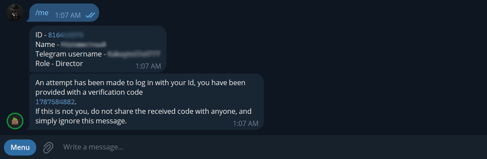
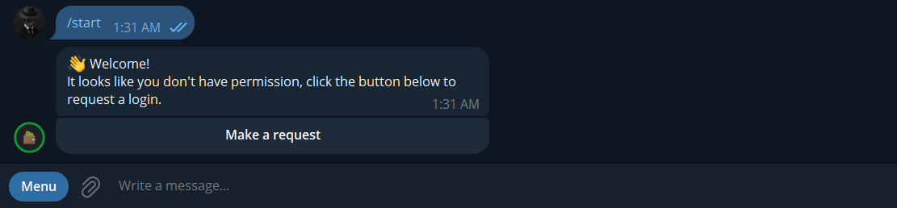
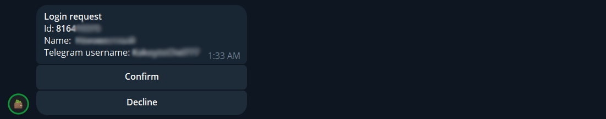

# Описание проекта "Financial manager":

## Языки
- [Українська](./README_UA.md)
- [English](./README.md)
- [Русский](./README_RU.md)

**"Financial manager"** - это проект приложения, созданный с использованием **WinUI3 Windows App SDK**. Этот проект объединяет два приложения: **сервер** и **клиент**. Сервер объединяет в себе логику взаимодействия с клиентом и логику работы бота в мессенджере Telegram, а также базу данных финансовых транзакций.

Клиент, в свою очередь, предназначен для взаимодействия бухгалтера с базой данных финансовых операций.

## О Telegram-боте

Telegram-бот в контексте проекта необходим для авторизации новых бухгалтеров в системе, а также быстрого просмотра ими списка финансовых операций и категорий с возможностью сортировки финансовых операций, но без возможности редактирования данных. Код подтверждения приходит именно в чат с ботом.

## Авторизация пользователя

При первом открытии приложения сотрудник увидит страницу с предложением войти в личный кабинет. Для этого необходимо ввести свой ID, который можно получить, пообщавшись с ботом Telegram и отправив команду **/me**. После того как сотрудник скопирует ее, вставит в соответствующее поле ввода и нажмет кнопку **"Отправить"**, боту в чате будет отправлен код подтверждения, после чего приложение перейдет на страницу, где ему будет предложено ввести полученный код.

Но для того чтобы получить код подтверждения, сотрудник уже должен быть в системе. Ниже пример первой авторизации или другими словами, регистрации, которая осуществляется через бота.

После того как пользователь отправляет запрос, директор получает новое сообщение с двумя вариантами ответа: подтвердить или отклонить.

## Рабочий пользовательский интерфейс. Обзор

После успешной авторизации, при первом входе в приложение, сотрудник увидит страницу со своим **"Профилем"**. На ней будет отображаться информация о сотруднике, которую можно просмотреть в боте с помощью команды **/me**. Кроме того, в любой момент в приложение может войти другой пользователь, так как текущий авторизованный пользователь может нажать на кнопку **"Log out"** на странице со своим профилем и выйти из системы. А новый пользователь сможет войти в приложение после подтверждения запроса. 

Помимо страницы **"Профиль "**, в навигационной панели слева есть кнопки для перехода на следующие страницы: **"Финансовые операции"** и **"Категории операций"**. Исходя из названий, одна из них отвечает за добавление финансовых операций в базу данных, а также их редактирование и удаление, а вторая - за те же процедуры, но с финансовыми категориями. Стоит отметить, что каждая финансовая операция не обязательно должна быть "приписана" к определенной категории. Также вы можете изменить тип "отбора" для элементов, другими словами, выделение. (например, изображение из списка категорий - **Multiply**, финансовые операции - **Single**)

## Рабочий пользовательский интерфейс. Функциональность

Для добавления нового элемента на обеих страницах есть кнопка со знаком плюс в правом нижнем углу, при нажатии на которую перед пользователем появляется диалоговое окно, в котором нужно ввести всю необходимую информацию.

Для финансовых операций предусмотрен функционал по их сортировке, который делится на: 

- Фильтрация
- Позиционная сортировка

Для фильтрации списка необходимо выбрать нужные параметры и нажать на кнопку **"Сортировка"**, а затем с помощью кнопок ниже, отсортировать элементы по возрастанию или убыванию, по следующим трём критериям:

- Название
- Сумма
- Дата создания

## Рабочий пользовательский интерфейс. Страницы ошибок

Если вы не можете подключиться к серверу, будет отображена эта страница.

А также в других критических, непредвиденных ситуациях будет отображаться эта страница, где пользователь может скопировать всю подробную информацию об ошибке и, например, передать ее в службу поддержки.
