# Опис проекту "Financial manager":

## Мови
- [English](./README.md)
- [Русский](./README_RU.md)
- [Українська](./README_UA.md)

**"Financial manager"** - це проект додаток, розроблений за допомогою **WinUI3 Windows App SDK**. Цей проект об'єднує два додатки: **сервер** та **клієнт**. Сервер поєднує в собі логіку взаємодії з клієнтом та логіку роботи бота в месенджері Telegram, а також базу даних фінансових операцій.

Клієнт, в свою чергу, призначений для взаємодії бухгалтера з базою даних фінансових операцій.

## Про Telegram-бота

Telegram-бот в контексті проекту необхідний для авторизації нових бухгалтерів в системі, а також швидкого перегляду ними списку фінансових операцій і категорій з можливістю сортування фінансових операцій, але без можливості редагування даних. Код підтвердження приходить саме в чаті з ботом.

## Авторизація користувача

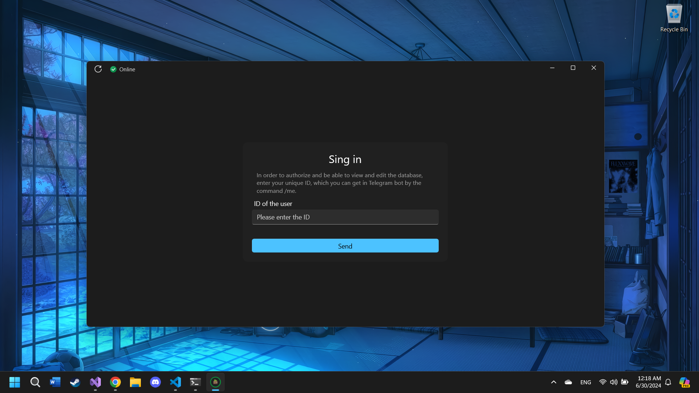
При першому відкритті додатку співробітник побачить сторінку з проханням увійти в особистий кабінет. Для цього потрібно ввести свій ідентифікатор, який можна отримати, поспілкувавшись з Telegram-ботом і відправивши команду **/me**. Після того, як співробітник скопіює її, вставить у відповідне поле введення та натисне кнопку **"Відправити "**, боту буде надіслано код підтвердження, в чаті додаток перейде на сторінку, де йому буде запропоновано ввести отриманий код.

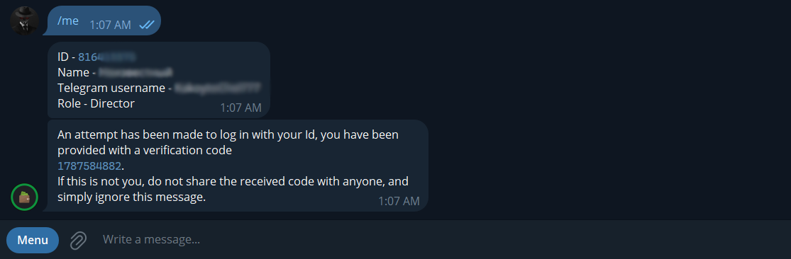

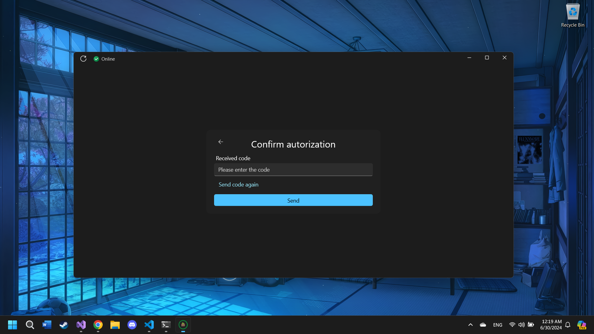

Але для того, щоб мати можливість отримати код підтвердження, працівник вже повинен бути в системі. Саме через бота відбувається його перша авторизація або, іншими словами, реєстрація.

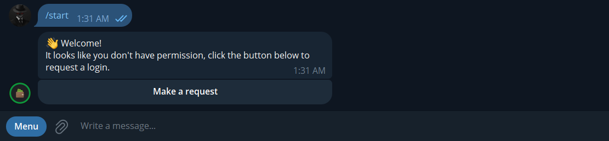

Після того, як користувач надіслав запит, директор отримує нове повідомлення з двома варіантами відповіді: підтвердити або відхилити.

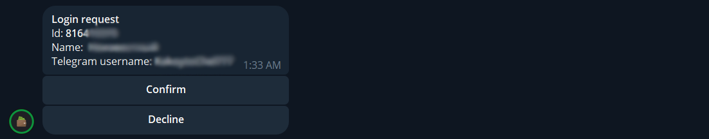

## Робочий інтерфейс. Огляд

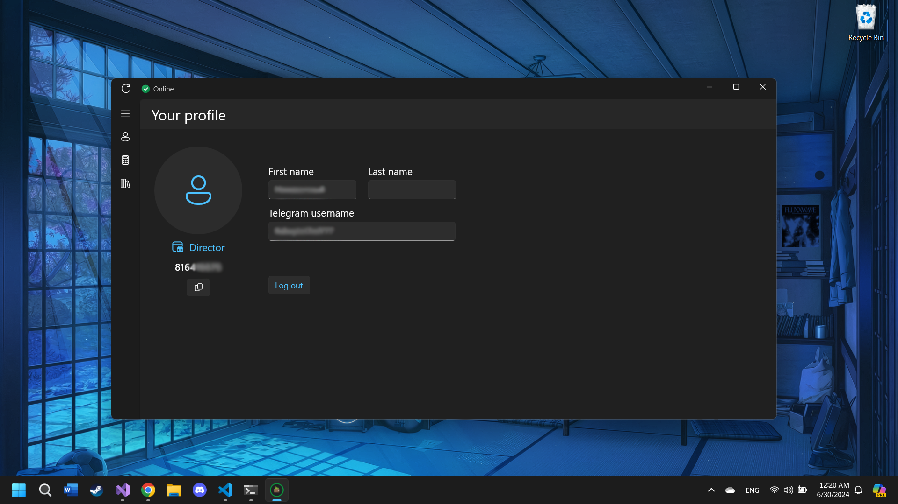

Після успішної авторизації, при першому вході в додаток, співробітник побачить сторінку зі своїм **"Профілем"**. На ній буде відображена інформація про співробітника, яку можна переглянути в боті за допомогою команди **/me**. Також у будь-який момент до додатку може увійти інший користувач, адже поточний авторизований користувач може натиснути на кнопку **"Вийти "** на сторінці зі своїм профілем і вийти з системи. А новий користувач може увійти після підтвердження запиту. 

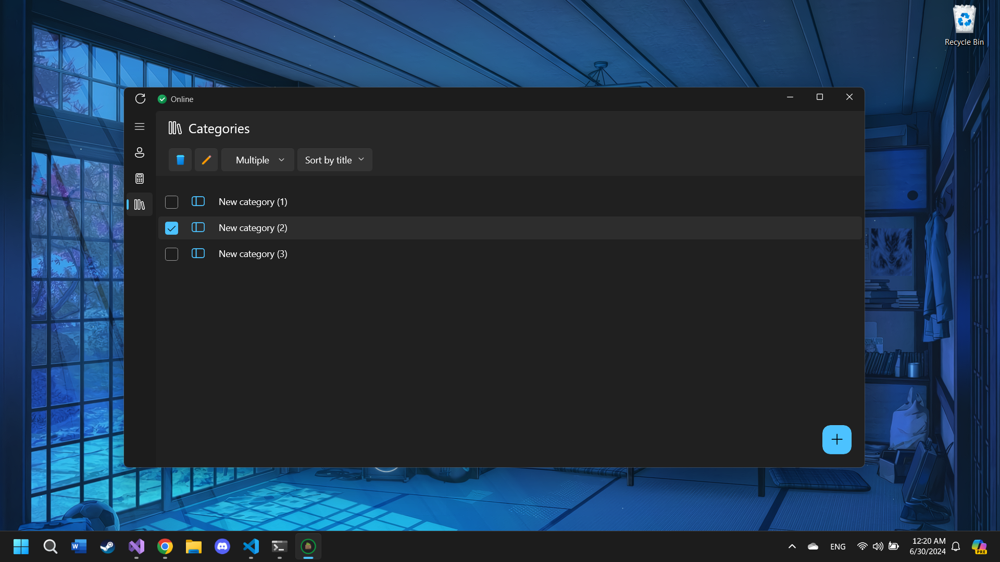

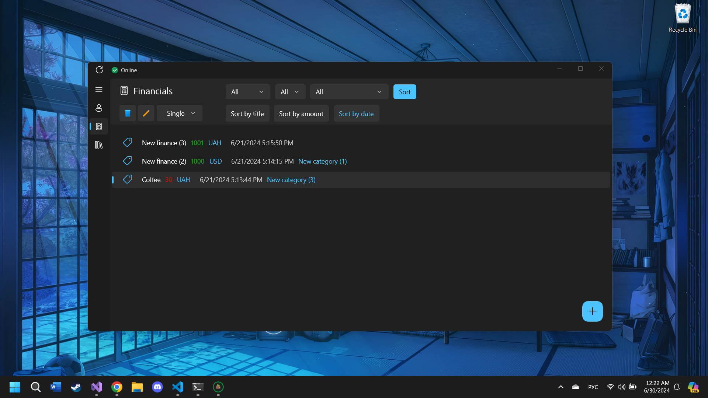

Крім сторінки **"Профіль "**, на панелі навігації зліва також є кнопки для переходу на наступні сторінки: **"Фінансові операції"** та **"Категорії операцій"**. Відповідно до назв, одна з них відповідає за додавання фінансових операцій до бази даних, а також їх редагування та видалення, а друга - за ті ж самі процедури, але з фінансовими категоріями. Слід зазначити, що кожна фінансова операція не обов'язково повинна бути "приписана" до певної категорії. Крім того, ви можете змінити тип "відбору" для елементів, іншими словами, селекцію. (наприклад, зображення зі списку категорій - **Множинні**, фінансові операції - **Одиничні**)

## Робочий інтерфейс. Функціональність

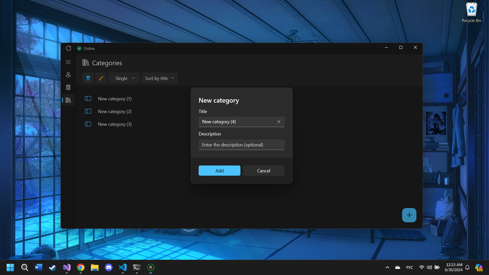

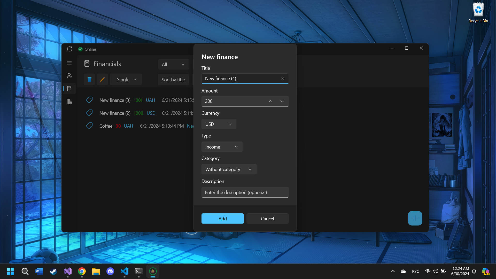

Для того, щоб додати новий товар, на обох сторінках в правому нижньому кутку є кнопка зі знаком плюс, натиснувши на яку, перед користувачем з'явиться діалогове вікно, де потрібно буде ввести всю необхідну інформацію.

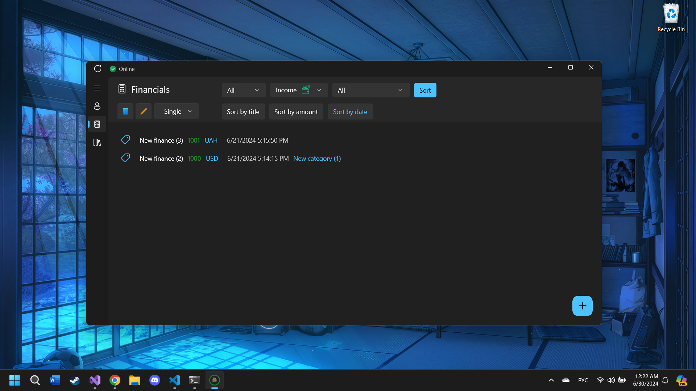

Для фінансових операцій передбачений функціонал їх сортування, який поділяється на: 

- Фільтрація
- Сортування позицій

Для фільтрації списку необхідно вибрати потрібні параметри і натиснути на кнопку **"Сортувати"**, а потім за допомогою кнопок нижче відсортувати позиції за зростанням або спаданням і за трьома наступними типами:

- Назва
- Сума
- Дата створення